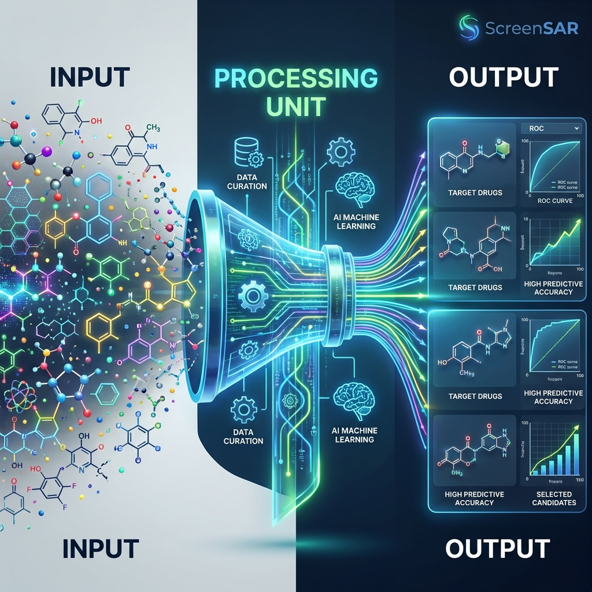

# ScreenSAR: Development of an Automated Platform for QSAR Data Curation, Modeling, and Virtual Screening

**Abstract**

Quantitative Structure-Activity Relationship (QSAR) modeling is a cornerstone of modern drug discovery, enabling the prediction of biological activity from chemical structure. However, the reliability of QSAR models is heavily dependent on the quality of input data and the robustness of the modeling workflow. This article presents **ScreenSAR**, a comprehensive, automated platform designed to streamline chemical data curation, machine learning model development, and virtual screening. The tool offers a modular architecture comprising standardized data cleaning, feature engineering (Morgan, MACCS, RDKit fingerprints), outlier analysis, and multi-model training with automatic performance ranking. We demonstrate the utility of ScreenSAR in enhancing reproducibility, efficiency, and accessibility in pharmaceutical research workflows, supported by a multilingual interface (English, Portuguese, German, Chinese, Japanese).

---

## 1. State of the Art: Data-Driven Drug Discovery

The pharmaceutical industry is undergoing a paradigm shift driven by Artificial Intelligence (AI) and Machine Learning (ML). The integration of "Big Data" from high-throughput screening (HTS) and public repositories like ChEMBL and PubChem has enabled the development of predictive models that can significantly accelerate the lead optimization phase.

### 1.1. The Data Quality Paradox
Despite these advancements, the "Garbage In, Garbage Out" principle remains the primary bottleneck. Studies estimate that up to **80% of a data scientist's time** is spent on data cleaning rather than modeling. Inconsistent chemical representations, stereochemical ambiguities, and experimental noise in large public datasets often lead to unreliable QSAR models with poor prospective predictive power.

### 1.2. Existing Solutions vs. ScreenSAR
Current state-of-the-art solutions for data curation range from commercial platforms (e.g., Pipeline Pilot, clean up nodes in KNIME) to code-heavy libraries (e.g., RDKit, MolVS).
*   **Commercial tools** offer polished UIs but come with prohibitive licensing costs and "black-box" opacity.
*   **Open-source libraries** offer transparency but require significant programming expertise, creating a barrier for medicinal chemists.

**ScreenSAR** advances the state of the art by democratizing access to robust curation. It combines the rigorous, standardized algorithms of code-based libraries with the accessibility of a modern web interface, effectively bridging the gap between raw data mining and high-quality, actionable QSAR models.

## 2. Materials and Methods

### 2.1. System Architecture
The application was built using **Python** and the **Streamlit** framework, ensuring a responsive, web-based user interface. The codebase follows a modular design pattern:
*   `src/core`: Business logic for curation and modeling.
*   `src/ui`: User interface components.
*   `src/utils`: Utility functions, including a robust **Internationalization (i18n)** system supporting five languages.

### 2.2. Data Curation Pipeline
The `CuradoriaQSAR` module automates critical steps to ensure data integrity:
1.  **Chemical Normalization**: Canonicalization of SMILES using RDKit, removal of salts/solvents, selection of the largest organic fragment, and neutralization of stereoisomers for consistent 2D representation.
2.  **Activity Standardization**: Automatic conversion of diverse units (uM, mM, M) to a standard **nM** baseline. Optionally calculates **pIC50** (-log10(M)) to linearize activity for modeling.
3.  **Duplicate Management**: Identifies biological duplicates (same InChIKey/SMILES).
    *   *Concordant*: Aggregates values using the **Geometric Mean**.
    *   *Discordant*: Removes compounds if activity variation exceeds 1 log unit (10x).
4.  **Binary Classification**: Assigns "Active" (1) or "Inactive" (0) labels based on user-defined thresholds (e.g., IC50 < 100 nM).

### 2.3. Feature Engineering and Chemical Space
To prepare data for machine learning, ScreenSAR provides flexible descriptor generation options:
*   **Fingerprints**: Supports **Morgan** (ECFP-like), **MACCS Keys**, and **RDKit** topological fingerprints. Users can customize bit-length (e.g., 1024, 2048) and radius.
*   **Visualization**: **Principal Component Analysis (PCA)** is used to reduce dimensionality and visualize the chemical space coverage of active vs. inactive compounds.
*   **Outlier Detection**: Statistical analysis (mean ± 3SD) automatically flags potential "activity cliffs" or experimental errors.

### 2.4. Machine Learning Modeling
The `ModeladorQSAR` module facilitates robust model training:
*   **Algorithms**: Random Forest, Support Vector Machines (SVM), Gradient Boosting, K-Nearest Neighbors (KNN), and Logistic Regression.
*   **Modelability**: Calculates the **MODI (Modelability Index)** to assess if the dataset is suitable for modeling (MODI > 0.65).
*   **Validation**: Uses stratified train-test splitting. Performance is evaluated via Accuracy, F1-Score, Sensitivity, Specificity, and **Area Under the ROC Curve (AUC)**.
*   **Ranking**: Models are automatically ranked by the **Matthews Correlation Coefficient (MCC)**, a robust metric for balanced and imbalanced datasets.

### 2.5. Prediction and Virtual Screening
A dedicated **Virtual Screening Module** allows users to deploy trained models (`.pkl` artifacts) to predict the activity of new, unseen compounds. This module accepts raw SMILES lists, generates the appropriate descriptors on-the-fly, and outputs binary predictions with probability scores.

## 3. Results

### 3.1. User Experience
The platform provides a unified dashboard where researchers can visually navigate the entire pipeline. The integration of a **Graphical Abstract** on the landing page immediately communicates the workflow logic. The multi-language support ensures accessibility for a global research community.

### 3.2. Automated Reporting
ScreenSAR generates professional, industry-ready **PDF Reports**. These documents summarize the best performing model, provide detailed confusion matrices, and render high-resolution ROC curves, facilitating regulatory documentation and internal reporting.

## 4. Strengths and Limitations

### 4.1. Strengths
*   **End-to-End Automation**: The tool bridges the gap between data retrieval and predictive modeling, significantly reducing the "time-to-insight" for medicinal chemists.
*   **Data Integrity**: The use of geometric means for concordant duplicates and rigorous unit standardization ensures high-quality input for ML models.
*   **Inclusivity**: The multilingual interface (supporting 5 languages) breaks down language barriers in global research teams.
*   **Transparency**: Open-source architecture and standardized workflows enhance scientific reproducibility.

### 4.2. Limitations
*   **Computational Scalability**: As a web-based tool running on local resources or standard cloud instances, performance may degrade with extremely large datasets (>1 million compounds) without backend optimization.
*   **2D Simplification**: The current stereochemistry neutralization step, while useful for general screening, may overlook activity cliff nuances driven by specific chiral centers.
*   **Input Dependency**: The pipeline is currently optimized for ChEMBL-formatted data; proprietary in-house datasets may require pre-processing adaptation.

## 5. Conclusion

**ScreenSAR** democratizes access to high-quality cheminformatics tools. By integrating rigorous data curation with advanced machine learning in a user-friendly environment, it empowers researchers to focus on hypothesis generation rather than manual data wrangling. Future capabilities will include Applicability Domain (AD) calculations and deep learning integration.

## 5. References

1.  OECD Principles for the Validation, for Regulatory Purposes, of (Q)SAR Models.
2.  Tropsha, A. (2010). Best Practices for QSAR Model Development. *Molecular Informatics*.
3.  Fourches, D., et al. (2010). Trust, but Verify: On the Importance of Chemical Structure Curation. *Journal of Chemical Information and Modeling*.

---
*Generated by ScreenSAR - AI Assistant*
