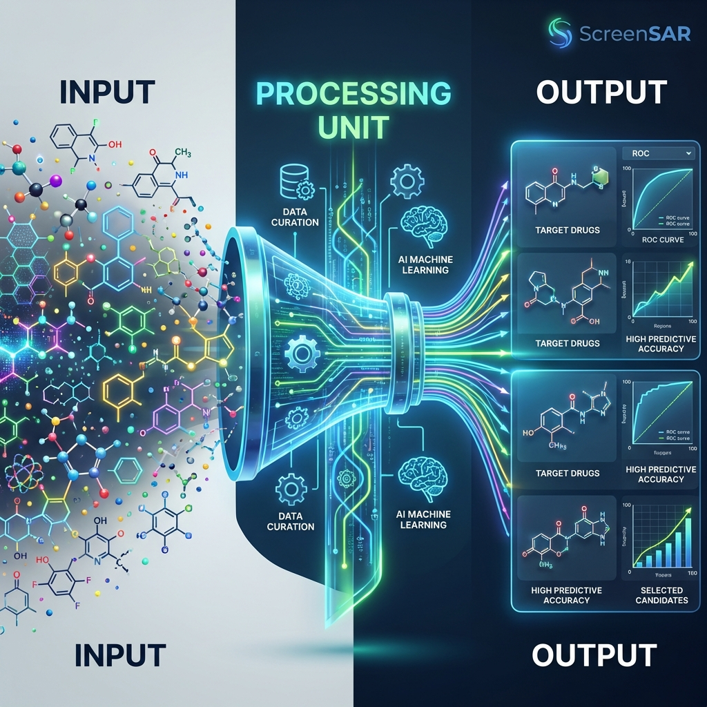

# ScreenSAR: Development of an Automated Platform for QSAR Data Curation, Modeling, and Virtual Screening



**Abstract**

Quantitative Structure-Activity Relationship (QSAR) modeling is a cornerstone of modern drug discovery, enabling the prediction of biological activity from chemical structure. However, the reliability of QSAR models is heavily dependent on the quality of input data and the robustness of the modeling workflow. This article presents **ScreenSAR**, a comprehensive, automated platform designed to streamline chemical data curation, machine learning model development, and **high-throughput virtual screening**. The tool offers a modular architecture comprising standardized data cleaning, feature engineering, and multi-model training. A key innovation is its **chunk-based processing engine**, which enables the reliable screening of **millions of compounds** on standard commercial hardware. We demonstrate the utility of ScreenSAR in enhancing reproducibility, efficiency, and accessibility in pharmaceutical research workflows.

---

## 1. State of the Art: Data-Driven Drug Discovery

The pharmaceutical industry is undergoing a paradigm shift driven by Artificial Intelligence (AI) and Machine Learning (ML). The integration of "Big Data" from high-throughput screening (HTS) and public repositories like ChEMBL and PubChem has enabled the development of predictive models that can significantly accelerate the lead optimization phase.

### 1.1. The Data Quality Paradox
Despite these advancements, the "Garbage In, Garbage Out" principle remains the primary bottleneck. Studies estimate that up to **80% of a data scientist's time** is spent on data cleaning rather than modeling. Inconsistent chemical representations, stereochemical ambiguities, and experimental noise in large public datasets often lead to unreliable QSAR models with poor prospective predictive power.

### 1.2. Existing Solutions vs. ScreenSAR
Current state-of-the-art solutions for data curation range from commercial platforms (e.g., Pipeline Pilot, clean up nodes in KNIME) to code-heavy libraries (e.g., RDKit, MolVS).
*   **Commercial tools** offer polished UIs but come with prohibitive licensing costs and "black-box" opacity.
*   **Open-source libraries** offer transparency but require significant programming expertise, creating a barrier for medicinal chemists.

**ScreenSAR** advances the state of the art by democratizing access to robust curation. It combines the rigorous, standardized algorithms of code-based libraries with the accessibility of a modern web interface, effectively bridging the gap between raw data mining and high-quality, actionable QSAR models.

## 2. Materials and Methods

### 2.1. Core Operational Components
ScreenSAR is structured around two distinct yet interconnected functional pillars, designed to separate model development from application:

1.  **Model Manufacturing and Optimization**: This component ingests raw biological activity data (e.g., from ChEMBL or in-house assays) to execute the end-to-end pipeline: data curation, feature engineering, and machine learning. It automatically evaluates multiple algorithms and identifies the best-performing model, which is then serialized and exported as a `.pkl` (Python Pickle) artifact.
2.  **Virtual Screening and Deployment**: This standalone component allows users to import a pre-trained `.pkl` model to screen external chemical libraries. It is engineered for **ultra-high-throughput production**, bypassing training overhead to focus solely on rapid descriptor generation and activity prediction for libraries containing **millions of molecular entities**.

### 2.2. System Architecture
The application was built using **Python** and the **Streamlit** framework, ensuring a responsive, web-based user interface. The codebase follows a modular design pattern structured as follows:

```
src/
├── core/                   # Scientific Business Logic
│   ├── curation.py         # Data cleaning and standardization
│   ├── modeling.py         # QSAR model training and validation
│   └── applicability.py    # Domain of Applicability assessment (k-NN based)
├── ui/                     # User Interface Components
│   ├── dashboard.py        # Main application layout
│   ├── prediction.py       # Virtual screening interface
│   └── sidebar.py          # Navigation control
└── utils/                  # Helper Utilities
    ├── report.py           # Automated PDF generation
    └── translations.py     # Internationalization (i18n) dictionary
```

**Figure 2: ScreenSAR Conceptual Workflow**


### 2.3. Data Curation Pipeline
The `CuradoriaQSAR` module automates critical steps to ensure data integrity:
1.  **Chemical Normalization**: Canonicalization of SMILES using RDKit, removal of salts/solvents, selection of the largest organic fragment, and neutralization of stereoisomers for consistent 2D representation.
2.  **Activity Standardization**: Automatic conversion of diverse units (uM, mM, M) to a standard **nM** baseline. Optionally calculates **pIC50** (-log10(M)) to linearize activity for modeling.
3.  **Duplicate Management**: Identifies biological duplicates (same InChIKey/SMILES).
    *   *Concordant*: Aggregates values using the **Geometric Mean**.
    *   *Discordant*: Removes compounds if activity variation exceeds 1 log unit (10x).
4.  **Binary Classification**: Assigns "Active" (1) or "Inactive" (0) labels based on user-defined thresholds (e.g., IC50 < 100 nM).

### 2.4. Feature Engineering and Chemical Space
To prepare data for machine learning, ScreenSAR provides flexible descriptor generation options:
*   **Fingerprints**: Supports **Morgan** (ECFP-like), **MACCS Keys**, and **RDKit** topological fingerprints. Users can customize bit-length (e.g., 1024, 2048) and radius.
*   **Visualization**: **Principal Component Analysis (PCA)** is used to reduce dimensionality and visualize the chemical space coverage of active vs. inactive compounds.
*   **Outlier Detection**: Statistical analysis (mean ± 3SD) automatically flags potential "activity cliffs" or experimental errors.

### 2.5. Machine Learning Modeling
The `ModeladorQSAR` module facilitates robust model training:
*   **Algorithms**: Random Forest, Support Vector Machines (SVM), Gradient Boosting, K-Nearest Neighbors (KNN), and Logistic Regression.
*   **Modelability**: Calculates the **MODI (Modelability Index)** to assess if the dataset is suitable for modeling (MODI > 0.65).
*   **Validation**: Uses stratified train-test splitting. Performance is evaluated via Accuracy, F1-Score, Sensitivity, Specificity, and **Area Under the ROC Curve (AUC)**.
*   **Ranking**: Models are automatically ranked by the **Matthews Correlation Coefficient (MCC)**, a robust metric for balanced and imbalanced datasets.

### 2.6. Prediction and Virtual Screening
A dedicated **Virtual Screening Module** allows users to deploy trained models (`.pkl` artifacts) to predict the activity of new, unseen compounds. This module is architected to handle massive datasets by accepting raw SMILES lists (CSV/TXT), generating the appropriate descriptors on-the-fly, and outputting binary predictions with quantified probability scores.

#### 2.6.1. Scalability and Memory Optimization (Chunking)
To enable the screening of ultra-large chemical libraries (millions of compounds) on standard hardware, ScreenSAR implements a **Chunk-based Processing Engine**. Instead of loading the entire dataset into RAM, the system:
1.  **Iterative Extraction**: Reads and processes molecules in configurable batches (default: 5,000 compounds per chunk).
2.  **On-the-fly Transformation**: Generates molecular descriptors and performs predictions for each chunk sequentially.
3.  **Memory Management**: Clears transient descriptors after each batch to maintain a constant and low memory footprint, preventing "Out of Memory" (OOM) crashes during long-running screening jobs.

### 2.7. Implementation Details and Code Structure

The ScreenSAR platform is engineered with a separation of concerns principle, distincting computational logic from interface rendering. This modularity ensures maintainability and scalability.

#### 2.6.1. Core Logic (`src/core`)
The backbone of the application resides in `src/core`, containing two primary classes that govern the scientific workflow:

*   **`CuradoriaQSAR` (`curation.py`)**: Encapsulates the entire data preparation pipeline.
    *   *Initialization*: Accepts raw data (CSV/Excel) and sets active thresholds.
    *   *Chemical Cleaning*: The `_limpar_quimica` method utilizes `rdkit.Chem.SaltRemover` to strip salts, identifies the largest organic fragment, and generates canonical SMILES to ensure unique structural representation.
    *   *Standardization*: The `executar_pipeline` method orchestrates unit conversion (to nM), aggregates duplicate entries using geometric means (for concordant data), and filters biological discordance (>1 log unit difference).
    *   *Feature Generation*: The `gerar_fingerprints` method supports dynamic generation of Morgan, MACCS, and RDKit fingerprints.

*   **`ModeladorQSAR` (`modeling.py`)**: Manages the machine learning lifecycle.
    *   *Data Preparation*: The `gerar_dados` method aligns molecular fingerprints ($X$) with biological activity labels ($y$).
    *   *Model Training*: The `treinar_avaliar` function implements a stratified train-test split (80:20 default) and trains five distinct algorithms (RF, SVM, GBM, KNN, LR) using `scikit-learn`.
    *   *Modelability*: The `calcular_modi` method computes the MODI index using Jaccard similarity to assess the feasibility of modeling the dataset.
    *   *Applicability Domain*: Integrated via the `ApplicabilityDomain` class, employing a k-Nearest Neighbors (k=5) approach to define the chemical space and preset reliability thresholds ($Z < 3.0$).

#### 2.6.2. User Interface, Reporting, and Utilities
The `src/ui` module manages the Streamlit-based frontend, with dedicated scripts for each functional tab (e.g., `prediction.py` for virtual screening), ensuring that rigorous backend computations are accessible via an intuitive dashboard.

Additionally, the `src/utils/report.py` module facilitates scientific communication:
*   **`PDFReport`**: Leveraging the `fpdf` library, this class automates document generation. It specifically formats scientific results, including ROC curves and metric tables, into a standardized structure suitable for regulatory submission or internal archiving.

## 3. Results

### 3.1. User Experience
The platform provides a unified dashboard where researchers can visually navigate the entire pipeline. The integration of a **Graphical Abstract** on the landing page immediately communicates the workflow logic. The multi-language support ensures accessibility for a global research community.

### 3.2. Automated Reporting
ScreenSAR generates professional, industry-ready **PDF Reports**. These documents summarize the best performing model, provide detailed confusion matrices, and render high-resolution ROC curves, facilitating regulatory documentation and internal reporting.

## 4. Strengths and Limitations

### 4.1. Strengths
*   **End-to-End Automation**: The tool bridges the gap between data retrieval and predictive modeling, significantly reducing the "time-to-insight" for medicinal chemists.
*   **Data Integrity**: The use of geometric means for concordant duplicates and rigorous unit standardization ensures high-quality input for ML models.
*   **Inclusivity**: The multilingual interface (supporting 5 languages) breaks down language barriers in global research teams.
*   **Scalability for Massive Datasets**: Unlike many research-grade tools that crash with large memory loads, ScreenSAR’s chunking mechanism empowers researchers to perform virtual screening of **millions of compounds** on standard laptops.
*   **Transparency**: Open-source architecture and standardized workflows enhance scientific reproducibility.

### 4.2. Limitations
*   **Infrastructure Sensitivity**: While chunking optimizes memory, the total execution time for extremely large datasets (>10 million compounds) remains dependent on local CPU throughput and storage I/O speeds.
*   **2D Simplification**: The current stereochemistry neutralization step, while useful for general screening, may overlook activity cliff nuances driven by specific chiral centers.
*   **Input Dependency**: The pipeline is currently optimized for ChEMBL-formatted data; proprietary in-house datasets may require pre-processing adaptation.

## 5. Conclusion

**ScreenSAR** democratizes access to high-quality cheminformatics tools. By integrating rigorous data curation, applicability domain assessment, and advanced machine learning in a user-friendly environment, it empowers researchers to focus on hypothesis generation rather than manual data wrangling. Its ability to perform **mass-scale virtual screening of millions of compounds** marks a significant advancement in making high-throughput predictive modeling accessible to the global research community. Future capabilities will focus on deep learning integration and cloud-native scaling.

## 6. References

1.  OECD Principles for the Validation, for Regulatory Purposes, of (Q)SAR Models.
2.  Tropsha, A. (2010). Best Practices for QSAR Model Development. *Molecular Informatics*.
3.  Fourches, D., et al. (2010). Trust, but Verify: On the Importance of Chemical Structure Curation. *Journal of Chemical Information and Modeling*.

---
*Generated by ScreenSAR - AI Assistant*
